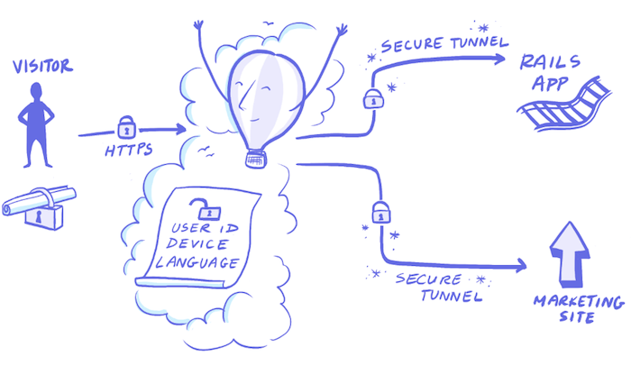

<a href="https://fly.io/slack/"></a>

# Superfly Rails 4+ Session Middleware App

A simple Rails application with login and logout.

It holds session information...

```
def remember(user)
  user.remember
  cookies.permanent.signed[:user_id] = user.id
  cookies.permanent[:remember_token] = user.remember_token
en
```

... And is configured to serialize its session cookies into `JSON`.

```
Rails.application.config.action_dispatch.cookies_serializer = :json
```

You can checkout a live demo of this repository here: https://fly-rails-session.herokuapp.com/.

This application can be used to demonstrate Fly.io Rails 4+ Session Aware routing. We've written a big ol' article on the topic, you can [read it here](https://fly.io/articles/routing-via-http-headers-with-rails-4/).

Through this tutorial, we'll show you how to mount this app to `example.com/app`. After that, you'll be able to use Fly Middleware to route users visiting `example.com` directly to your application if their session contains a `userId` and to your marketing page if their session does not.



You can [create an account](https://fly.io) and explore Fly for free.
